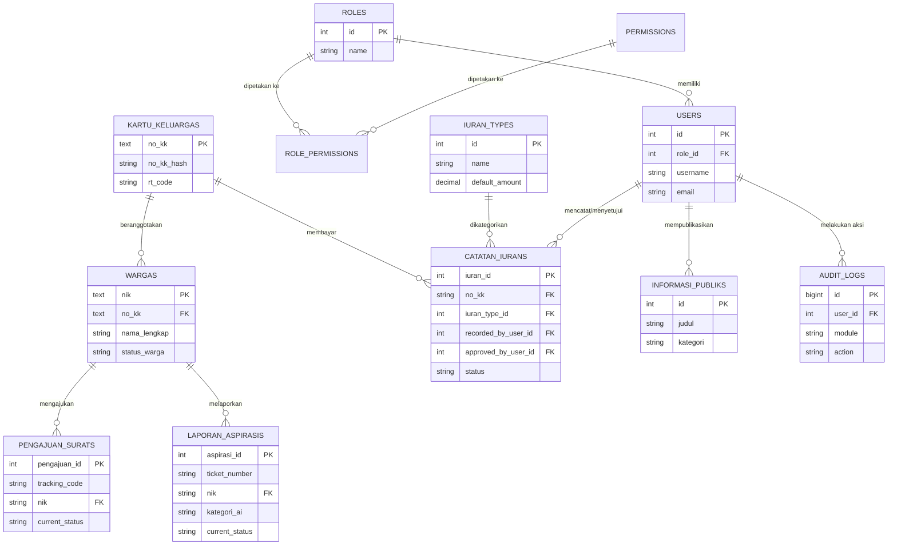

# DATABASE SCHEMA
## SIM Layanan Warga RW 047 — Database Design Document

| | |
|---|---|
| **Dokumen turunan dari** | PRD SIM Layanan Warga RW 047 v1.0, SYSTEM_ARCHITECTURE.md v1.0, dan naskah skripsi acuan (Final_v8_revisi_full_teks.pdf) |
| **Versi dokumen** | 1.0 |
| **Status** | Draft teknis untuk tim development |
| **Audiens** | Backend Engineer, Database Administrator, System Analyst |

---

## 1. Gambaran Umum Basis Data (Database Overview)

### 1.1 Jenis Basis Data yang Direkomendasikan

> **Relational Database Management System (RDBMS) — PostgreSQL (direkomendasikan) atau MySQL 8+ sebagai alternatif**

### 1.2 Alasan Pemilihan

| Pertimbangan | Penjelasan |
|---|---|
| **Sifat data sangat terstruktur & relasional** | Domain sistem (kependudukan, persuratan, keuangan, laporan) memiliki relasi antarentitas yang jelas dan tetap (KK ↔ Warga, Surat ↔ Warga, Iuran ↔ KK ↔ Jenis Iuran) — cocok dimodelkan sebagai skema relasional dengan foreign key yang tegas, bukan dokumen bebas skema (NoSQL). |
| **Kebutuhan integritas & konsistensi transaksional (ACID)** | Proses seperti verifikasi surat berjenjang dan validasi pembayaran iuran memerlukan jaminan transaksi atomik (mis. update status + catat audit log harus konsisten) — RDBMS unggul di sini dibanding model *eventual consistency* pada banyak database NoSQL. |
| **Kebutuhan query relasional kompleks** | Laporan keuangan, rekapitulasi per RT/periode, dan dashboard monitoring memerlukan JOIN antar banyak tabel serta agregasi (`SUM`, `GROUP BY`) — jauh lebih alami dan efisien di RDBMS. |
| **Kebutuhan enkripsi kolom & pencarian presisi (hash index)** | Pola enkripsi AES-256 untuk NIK/No. KK dengan kolom hash pendamping (HMAC-SHA256) untuk pencarian presisi memerlukan tipe kolom dan indeks unik yang eksplisit — didukung penuh oleh RDBMS modern. |
| **Evolusi dari sistem acuan** | Sistem acuan (skripsi) sudah menggunakan RDBMS (SQLite) dengan skema ERD/LRS yang matang. Migrasi ke PostgreSQL/MySQL mempertahankan model data yang sudah teruji, hanya meningkatkan kapabilitas concurrency dan skalabilitas untuk kebutuhan produksi. |

### 1.3 PostgreSQL vs MySQL — Perbandingan Singkat

| Aspek | PostgreSQL (direkomendasikan) | MySQL 8+ (alternatif) |
|---|---|---|
| Dukungan tipe data lanjutan (JSONB, full-text search native) | Lebih kuat — berguna jika field `description`/`teks_keluhan` perlu pencarian teks lanjutan di masa depan | Cukup, tapi kurang fleksibel untuk JSON kompleks |
| Row-level security | Native, dapat memperkuat RBAC di level database | Tidak native |
| Ekosistem Laravel | Didukung penuh (driver `pgsql`) | Didukung penuh (driver `mysql`) — lebih familiar bagi tim yang berasal dari ekosistem SQLite/MySQL |
| Rekomendasi akhir | **Pilihan utama** untuk fitur lanjutan & kepatuhan data | Alternatif valid bila tim lebih familiar/hosting sudah tersedia |

### 1.4 Perubahan Kunci dari Sistem Acuan

| Sistem Acuan (Skripsi) | Rebuild |
|---|---|
| SQLite (file-based, single-writer) | PostgreSQL/MySQL (server-based, mendukung concurrency multi-user) |
| Tipe `TEXT` untuk kolom terenkripsi (menghindari truncation Base64) | Tetap dipertahankan — `TEXT` atau `BYTEA` (PostgreSQL) untuk ciphertext AES-256 |
| Tidak ada tabel Role terpisah (role disebut implisit) | Ditambahkan tabel `roles` & `permissions` eksplisit (mendukung package `spatie/laravel-permission`, lihat SYSTEM_ARCHITECTURE.md) |
| Audit trail terbatas pada `created_at`/`updated_at`/`deleted_at` | Ditambahkan tabel `audit_logs` terpusat untuk pencatatan aktivitas lintas modul |

---

## 2. Daftar Tabel/Koleksi (Table List)

| # | Nama Tabel | Domain | Deskripsi Singkat |
|---|---|---|---|
| 1 | `users` | Autentikasi & RBAC | Akun pengguna sistem (seluruh 6 peran) |
| 2 | `roles` | Autentikasi & RBAC | Master peran (Warga, Ketua RT, Sekretaris RW, Bendahara RW, Ketua RW, Super Admin) |
| 3 | `permissions` | Autentikasi & RBAC | Master hak akses granular per fitur |
| 4 | `role_permissions` | Autentikasi & RBAC | Tabel pivot relasi Many-to-Many antara `roles` dan `permissions` |
| 5 | `kartu_keluargas` | Kependudukan | Data induk Kartu Keluarga (KK) |
| 6 | `wargas` | Kependudukan | Data anggota keluarga/penduduk |
| 7 | `pengajuan_surats` | Persuratan | Data permohonan surat & status verifikasi berjenjang |
| 8 | `laporan_aspirasis` | Laporan & Aspirasi | Data laporan/pengaduan/aspirasi warga |
| 9 | `iuran_types` | Keuangan | Master jenis iuran RW |
| 10 | `catatan_iurans` | Keuangan | Transaksi pencatatan pembayaran iuran warga |
| 11 | `informasi_publiks` | Informasi Publik | Pengumuman, berita, agenda kegiatan RW |
| 12 | `audit_logs` | Pendukung | Log audit lintas modul (siapa, kapan, aksi apa) |

> Penamaan tabel mengikuti konvensi Laravel Eloquent (snake_case, plural). Nama tabel pada dokumen ini merujuk langsung ke nama entitas pada ERD/LRS skripsi acuan, dengan penyesuaian minor (mis. `kartu_keluargas`, bentuk plural default Eloquent).

---

## 3. Detail Struktur Tabel (Table Structure Details)

### 3.1 Tabel `users`

Menyimpan data akun pengguna untuk seluruh peran sistem, digunakan dalam proses autentikasi dan penerapan RBAC.

| Field Name | Data Type | Constraints | Description |
|---|---|---|---|
| `id` | INT (Auto Increment) | **PK**, NOT NULL | ID unik identitas pengguna |
| `role_id` | INT | **FK** → `roles.id`, NOT NULL | Referensi ke peran/role pengguna |
| `username` | VARCHAR(50) | UNIQUE, NOT NULL | Nama alias unik untuk identitas login |
| `full_name` | VARCHAR(100) | NOT NULL | Nama lengkap pengguna/pengurus |
| `email` | VARCHAR(100) | UNIQUE, NOT NULL | Alamat email resmi untuk otentikasi login |
| `password` | VARCHAR(255) | NOT NULL | Kata sandi terenkripsi satu arah (bcrypt/argon2) |
| `phone_number` | VARCHAR(20) | NULLABLE | Nomor kontak/WhatsApp pengurus |
| `rt_code` | VARCHAR(20) | NULLABLE, INDEX | Kode wilayah RT (area scoping — hanya relevan untuk role Ketua RT) |
| `status` | ENUM('ACTIVE','INACTIVE') | NOT NULL, DEFAULT `ACTIVE` | Status aktif/nonaktif akun pengguna |
| `last_login_at` | DATETIME | NULLABLE | Catatan waktu terakhir kali pengguna login |
| `created_at` | TIMESTAMP | NULLABLE | Catatan waktu pembuatan akun |
| `updated_at` | TIMESTAMP | NULLABLE | Catatan waktu pembaruan data akun |
| `deleted_at` | TIMESTAMP | NULLABLE | Soft delete — catatan waktu penghapusan logis |

---

### 3.2 Tabel `roles` *(baru — penguatan RBAC)*

Master peran sistem, menggantikan penyimpanan role secara implisit pada sistem acuan.

| Field Name | Data Type | Constraints | Description |
|---|---|---|---|
| `id` | INT (Auto Increment) | **PK**, NOT NULL | ID unik peran |
| `name` | VARCHAR(50) | UNIQUE, NOT NULL | Nama peran (`WARGA`, `KETUA_RT`, `SEKRETARIS_RW`, `BENDAHARA_RW`, `KETUA_RW`, `SUPER_ADMIN`) |
| `display_name` | VARCHAR(100) | NOT NULL | Nama tampilan peran untuk UI |
| `description` | TEXT | NULLABLE | Deskripsi tanggung jawab peran |
| `created_at` | TIMESTAMP | NULLABLE | Catatan waktu pembuatan data |
| `updated_at` | TIMESTAMP | NULLABLE | Catatan waktu pembaruan data |

---

### 3.3 Tabel `permissions` *(baru — penguatan RBAC)*

Master hak akses granular yang dapat dipetakan ke satu atau lebih peran.

| Field Name | Data Type | Constraints | Description |
|---|---|---|---|
| `id` | INT (Auto Increment) | **PK**, NOT NULL | ID unik permission |
| `name` | VARCHAR(100) | UNIQUE, NOT NULL | Kode permission (mis. `surat.verify`, `warga.edit`, `keuangan.approve`) |
| `module` | VARCHAR(50) | NOT NULL | Modul terkait permission (mis. `Persuratan`, `Kependudukan`, `Keuangan`) |
| `created_at` | TIMESTAMP | NULLABLE | Catatan waktu pembuatan data |
| `updated_at` | TIMESTAMP | NULLABLE | Catatan waktu pembaruan data |

---

### 3.4 Tabel `role_permissions` *(baru — pivot RBAC)*

Tabel pivot relasi Many-to-Many antara `roles` dan `permissions`.

| Field Name | Data Type | Constraints | Description |
|---|---|---|---|
| `id` | INT (Auto Increment) | **PK**, NOT NULL | ID unik baris pivot |
| `role_id` | INT | **FK** → `roles.id`, NOT NULL | Referensi peran |
| `permission_id` | INT | **FK** → `permissions.id`, NOT NULL | Referensi permission |
| | | UNIQUE (`role_id`, `permission_id`) | Kombinasi role + permission harus unik |

---

### 3.5 Tabel `kartu_keluargas`

Menyimpan data pokok setiap Kartu Keluarga (KK) yang terdaftar di wilayah RW. Menjadi entitas induk bagi data warga.

| Field Name | Data Type | Constraints | Security Spec | Description |
|---|---|---|---|---|
| `no_kk` | TEXT | **PK**, NOT NULL | AES-256-CBC Encrypted | Nomor KK 16-digit, terenkripsi |
| `no_kk_hash` | VARCHAR(64) | NOT NULL, INDEX | HMAC-SHA256 Hash | Hash deterministik untuk pencarian presisi |
| `rt_code` | VARCHAR(20) | NOT NULL, INDEX | — | Kode wilayah RT tempat tinggal KK |
| `alamat_lengkap` | TEXT | NOT NULL | AES-256-CBC Encrypted | Alamat domisili lengkap, terenkripsi |
| `blok` | VARCHAR(20) | NULLABLE | — | Kode blok/wilayah perumahan |
| `nomor_rumah` | VARCHAR(20) | NULLABLE | — | Nomor rumah tempat tinggal |
| `status_kepemilikan_rumah` | VARCHAR(50) | NOT NULL | — | Status hunian (Milik Sendiri, Kontrak, Sewa) |
| `created_at` | TIMESTAMP | NULLABLE | — | Catatan waktu pendaftaran data KK |
| `updated_at` | TIMESTAMP | NULLABLE | — | Catatan waktu pembaruan data KK |
| `deleted_at` | TIMESTAMP | NULLABLE | SoftDeletes | Catatan waktu penghapusan logis |

---

### 3.6 Tabel `wargas`

Menyimpan informasi setiap penduduk yang terdaftar pada wilayah administrasi RW. Menjadi referensi utama bagi berbagai layanan sistem.

| Field Name | Data Type | Constraints | Security Spec | Description |
|---|---|---|---|---|
| `nik` | TEXT | **PK**, NOT NULL | AES-256-CBC Encrypted | Nomor Induk Kependudukan 16-digit, terenkripsi |
| `nik_hash` | VARCHAR(64) | NOT NULL, INDEX | HMAC-SHA256 Hash | Hash deterministik NIK untuk pencarian data |
| `no_kk` | TEXT | **FK** → `kartu_keluargas.no_kk`, NOT NULL | AES-256-CBC Encrypted | Referensi ke nomor KK tempat warga terdaftar |
| `no_kk_hash` | VARCHAR(64) | NOT NULL, INDEX | HMAC-SHA256 Hash | Hash deterministik No. KK untuk pencarian presisi relasi keluarga (exact-match lookup) |
| `nama_lengkap` | VARCHAR(100) | NOT NULL, INDEX | — | Nama lengkap warga sesuai identitas resmi |
| `jenis_kelamin` | ENUM('L','P') | NOT NULL | — | Jenis kelamin (Laki-laki/Perempuan) |
| `tempat_lahir` | VARCHAR(255) | NOT NULL | AES-256-CBC Encrypted | Kota/Kabupaten tempat lahir |
| `tanggal_lahir` | DATE | NOT NULL | — | Tanggal lahir warga |
| `pekerjaan` | VARCHAR(100) | NULLABLE | — | Profesi/pekerjaan utama warga |
| `nomor_hp` | VARCHAR(255) | NULLABLE | AES-256-CBC Encrypted | Nomor telepon/WhatsApp aktif, terenkripsi |
| `status_hubungan_keluarga` | VARCHAR(50) | NOT NULL | — | Kedudukan dalam keluarga (Kepala Keluarga, Istri, Anak, dll) |
| `status_sosio_ekonomi` | VARCHAR(50) | NULLABLE | — | Indikator kelas sosial ekonomi keluarga |
| `status_warga` | VARCHAR(50) | NOT NULL, DEFAULT `TETAP` | — | Status domisili kependudukan (TETAP, KONTRAK, PINDAH, MENINGGAL) |
| `verification_status` *(baru)* | ENUM('MENUNGGU_VERIFIKASI','TERVERIFIKASI','DITOLAK') | NOT NULL, DEFAULT `MENUNGGU_VERIFIKASI` | — | Status verifikasi data warga oleh Sekretaris RW (lihat PRD.md FR-02, USER_STORIES.md US-KEP-01/02) |
| `verified_by_user_id` *(baru)* | INT | **FK** → `users.id`, NULLABLE | — | ID Sekretaris RW yang memverifikasi data |
| `verification_notes` *(baru)* | TEXT | NULLABLE | — | Catatan/alasan saat data ditolak verifikasinya |
| `created_at` | TIMESTAMP | NULLABLE | — | Catatan waktu pendataan warga |
| `updated_at` | TIMESTAMP | NULLABLE | — | Catatan waktu pembaruan profil warga |
| `deleted_at` | TIMESTAMP | NULLABLE | SoftDeletes | Catatan waktu penghapusan logis |

> **Catatan migrasi:** kolom `verification_status`, `verified_by_user_id`, dan `verification_notes` adalah **penambahan** terhadap skema sistem acuan, diperlukan untuk mendukung alur verifikasi data warga berjenjang (Ketua RT input → Sekretaris RW verifikasi) yang dijelaskan pada USER_STORIES.md namun sebelumnya tidak memiliki representasi data eksplisit.

---

### 3.7 Tabel `pengajuan_surats`

Menyimpan data permohonan surat yang diajukan oleh warga beserta informasi proses verifikasi dan penyelesaiannya.

| Field Name | Data Type | Constraints | Description |
|---|---|---|---|
| `pengajuan_id` | INT (Auto Increment) | **PK**, NOT NULL | ID unik pengajuan surat |
| `tracking_code` | VARCHAR(64) | UNIQUE, NOT NULL, INDEX | Kode unik pelacakan surat untuk pemohon publik |
| `nik` | VARCHAR(255) | **FK** → `wargas.nik`, NOT NULL | NIK warga pemohon surat pengantar |
| `nomor_surat` | VARCHAR(100) | NULLABLE | Nomor resmi surat pengantar (diterbitkan saat status `COMPLETED`) |
| `jenis_surat` | ENUM('SURAT_PENGANTAR','SURAT_KETERANGAN_DOMISILI') | NOT NULL | Jenis dokumen surat yang diminta |
| `keperluan` | TEXT | NOT NULL | Maksud dan alasan keperluan pembuatan surat |
| `current_status` | ENUM('SUBMITTED','RT_REVIEW','RW_REVIEW','COMPLETED','REJECTED') | NOT NULL, DEFAULT `SUBMITTED` | Status linimasa verifikasi surat berjenjang |
| `tanggal_pengajuan` | DATETIME | NOT NULL | Waktu formulir surat dikirim oleh warga |
| `tanggal_selesai` | DATETIME | NULLABLE | Waktu permohonan surat selesai disetujui atau ditolak |
| `created_at` | TIMESTAMP | NULLABLE | Catatan waktu pembuatan record |
| `updated_at` | TIMESTAMP | NULLABLE | Catatan waktu pembaruan record |
| `deleted_at` | TIMESTAMP | NULLABLE | Soft delete |

---

### 3.8 Tabel `laporan_aspirasis`

Menyimpan laporan maupun aspirasi yang disampaikan warga melalui aplikasi web, termasuk hasil klasifikasi otomatis AI.

| Field Name | Data Type | Constraints | Security Spec | Description |
|---|---|---|---|---|
| `aspirasi_id` | INT (Auto Increment) | **PK**, NOT NULL | — | ID unik utama laporan pengaduan |
| `ticket_number` | VARCHAR(64) | UNIQUE, NOT NULL, INDEX | — | Nomor tiket unik pelacakan pengaduan warga |
| `nik` | VARCHAR(255) | **FK** → `wargas.nik`, NOT NULL | AES-256-CBC Encrypted | NIK warga pelapor, terenkripsi |
| `kanal_laporan` | VARCHAR(20) | NOT NULL, DEFAULT `WEB` | — | Saluran submisi laporan |
| `judul_laporan` | VARCHAR(150) | NOT NULL | — | Ringkasan/judul singkat pengaduan |
| `teks_keluhan` | TEXT | NOT NULL | Sanitized Input | Deskripsi narasi rinci permasalahan |
| `lokasi_kejadian` | TEXT | NULLABLE | — | Detail lokasi atau alamat tempat kejadian |
| `kategori_ai` *(baru)* | VARCHAR(50) | NULLABLE | — | Kategori hasil klasifikasi otomatis AI (mis. Infrastruktur, Keamanan, Kebersihan) |
| `skor_prioritas_ai` *(baru)* | DECIMAL(5,2) | NULLABLE | — | Skor prioritas hasil klasifikasi AI (mendukung urutan penanganan pengurus) |
| `current_status` | ENUM('SUBMITTED','CLASSIFIED','IN_PROGRESS','RESOLVED','CLOSED') | NOT NULL, DEFAULT `SUBMITTED` | — | Status penanganan laporan terkini |
| `submitted_at` | DATETIME | NOT NULL | — | Timestamp warga mengirimkan laporan |
| `resolved_at` | DATETIME | NULLABLE | — | Timestamp laporan selesai ditangani |
| `created_at` | TIMESTAMP | NULLABLE | — | Catatan waktu pembuatan record |
| `updated_at` | TIMESTAMP | NULLABLE | — | Catatan waktu pembaruan record |
| `deleted_at` | TIMESTAMP | NULLABLE | SoftDeletes | Catatan waktu penghapusan logis |

> **Catatan:** kolom `kategori_ai` dan `skor_prioritas_ai` merupakan **penambahan** terhadap skema sistem acuan untuk mengakomodasi fitur klasifikasi laporan berbasis AI (Kata Kunci: *Artificial Intelligence, Klasifikasi Laporan* pada abstrak skripsi) secara eksplisit di level data, bukan hanya berupa proses eksternal yang tidak tersimpan hasilnya.

---

### 3.9 Tabel `iuran_types`

Tabel master jenis-jenis iuran beserta informasi nominal standar yang berlaku di lingkungan RW.

| Field Name | Data Type | Constraints | Description |
|---|---|---|---|
| `id` | INT (Auto Increment) | **PK**, NOT NULL | ID unik jenis iuran |
| `name` | VARCHAR(100) | NOT NULL | Nama jenis iuran (mis. Iuran Kebersihan & Keamanan, Kas RW) |
| `code` | VARCHAR(50) | UNIQUE, NOT NULL | Kode unik jenis iuran |
| `default_amount` | DECIMAL(12,2) | NOT NULL | Nominal standar iuran per periode bulanan |
| `description` | TEXT | NULLABLE | Penjelasan peruntukan dana iuran |
| `is_active` | BOOLEAN | NOT NULL, DEFAULT `TRUE` | Status keaktifan jenis iuran |
| `created_at` | TIMESTAMP | NULLABLE | Catatan waktu pembuatan data |
| `updated_at` | TIMESTAMP | NULLABLE | Catatan waktu pembaruan data |

---

### 3.10 Tabel `catatan_iurans`

Menyimpan data transaksi pembayaran iuran warga berdasarkan Kartu Keluarga, termasuk proses pencatatan oleh Ketua RT dan verifikasi oleh Bendahara RW.

| Field Name | Data Type | Constraints | Security Spec | Description |
|---|---|---|---|---|
| `iuran_id` | INT (Auto Increment) | **PK**, NOT NULL | — | ID unik pencatatan iuran warga |
| `no_kk` | VARCHAR(512) | **FK** → `kartu_keluargas.no_kk`, NOT NULL | AES-256-CBC Encrypted | Nomor KK pembayar iuran, terenkripsi |
| `iuran_type_id` | INT | **FK** → `iuran_types.id`, NOT NULL | — | Referensi ID jenis iuran yang dibayar |
| `nominal` | DECIMAL(12,2) | NOT NULL | — | Jumlah dana iuran yang disetorkan |
| `periode_bulan` | TINYINT | NOT NULL | — | Periode bulan iuran (skala 1 s.d. 12) |
| `periode_tahun` | SMALLINT | NOT NULL | — | Periode tahun iuran (mis. 2026) |
| `tanggal_pembayaran` | DATE | NULLABLE | — | Tanggal aktual warga menyerahkan uang |
| `recorded_by_user_id` | INT | **FK** → `users.id`, NOT NULL | — | ID Ketua RT yang mencatat setoran iuran |
| `approved_by_user_id` | INT | **FK** → `users.id`, NULLABLE | — | ID Bendahara RW yang memverifikasi setoran |
| `approved_at` | DATETIME | NULLABLE | — | Timestamp saat disetujui Bendahara |
| `status` | ENUM('PENDING','APPROVED','REJECTED') | NOT NULL, DEFAULT `PENDING` | — | Status persetujuan setoran iuran |
| `payment_proof_path` | VARCHAR(255) | NULLABLE | — | Path bukti transfer (jika pembayaran non-tunai) |
| `rejection_notes` | TEXT | NULLABLE | — | Alasan penolakan jika setoran ditolak Bendahara |
| `created_at` | TIMESTAMP | NULLABLE | — | Catatan waktu pembuatan record |
| `updated_at` | TIMESTAMP | NULLABLE | — | Catatan waktu pembaruan record |

> **Constraint tambahan** *(baru — keputusan rebuild v1)*: `UNIQUE (no_kk, iuran_type_id, periode_bulan, periode_tahun)` — mencegah pencatatan ganda untuk kombinasi KK, jenis iuran, dan periode yang sama. Kombinasi yang sudah tercatat (status apa pun selain `REJECTED`) akan ditolak oleh database dengan pelanggaran unique constraint, yang diterjemahkan API menjadi `409 Conflict` (lihat API_SPECIFICATION.md §3.6.2). Baris berstatus `REJECTED` dikecualikan dari constraint ini (via partial/filtered unique index) agar Ketua RT tetap bisa mencatat ulang transaksi yang sebelumnya ditolak Bendahara.

---

### 3.11 Tabel `informasi_publiks` *(disederhanakan dari deskripsi FR-06 PRD)*

Menyimpan pengumuman, berita, dan agenda kegiatan RW yang dapat diakses warga.

| Field Name | Data Type | Constraints | Description |
|---|---|---|---|
| `id` | INT (Auto Increment) | **PK**, NOT NULL | ID unik konten informasi publik |
| `judul` | VARCHAR(150) | NOT NULL | Judul pengumuman/berita/agenda |
| `konten` | TEXT | NOT NULL | Isi lengkap konten |
| `kategori` | ENUM('PENGUMUMAN','BERITA','AGENDA') | NOT NULL | Jenis konten informasi publik |
| `tanggal_publikasi` | DATE | NOT NULL | Tanggal konten dipublikasikan |
| `tanggal_agenda` | DATE | NULLABLE | Tanggal pelaksanaan (khusus kategori AGENDA) |
| `published_by_user_id` | INT | **FK** → `users.id`, NOT NULL | Referensi pengurus yang mempublikasikan konten |
| `status` | ENUM('DRAFT','PUBLISHED','ARCHIVED') | NOT NULL, DEFAULT `DRAFT` | Status publikasi konten |
| `created_at` | TIMESTAMP | NULLABLE | Catatan waktu pembuatan data |
| `updated_at` | TIMESTAMP | NULLABLE | Catatan waktu pembaruan data |
| `deleted_at` | TIMESTAMP | NULLABLE | Soft delete |

---

### 3.12 Tabel `audit_logs` *(baru — penguatan Auditability, NFR-07 pada PRD)*

Mencatat aktivitas penting lintas modul untuk mendukung akuntabilitas dan penelusuran perubahan data.

| Field Name | Data Type | Constraints | Description |
|---|---|---|---|
| `id` | BIGINT (Auto Increment) | **PK**, NOT NULL | ID unik entri log |
| `user_id` | INT | **FK** → `users.id`, NULLABLE | Pengguna yang melakukan aksi (nullable untuk aksi sistem otomatis, mis. job klasifikasi AI) |
| `module` | VARCHAR(50) | NOT NULL | Modul terkait aksi (mis. `Persuratan`, `Keuangan`) |
| `action` | VARCHAR(100) | NOT NULL | Jenis aksi (mis. `CREATE`, `UPDATE`, `VERIFY`, `DELETE`, `VIEW_SENSITIVE_DATA`) |
| `entity_type` | VARCHAR(100) | NOT NULL | Nama entitas/tabel yang terdampak |
| `entity_id` | VARCHAR(100) | NOT NULL | ID record yang terdampak |
| `old_values` | TEXT (JSON) | NULLABLE | Nilai sebelum perubahan (opsional, untuk aksi UPDATE) |
| `new_values` | TEXT (JSON) | NULLABLE | Nilai sesudah perubahan (opsional, untuk aksi UPDATE) |
| `ip_address` | VARCHAR(45) | NULLABLE | Alamat IP pelaku aksi |
| `created_at` | TIMESTAMP | NULLABLE | Waktu aksi terjadi |

---

## 4. Relasi antar Tabel (Entity Relationships)

### 4.1 Ringkasan Relasi

| Tabel Induk | Relasi | Tabel Anak | Jenis Relasi | Foreign Key |
|---|---|---|---|---|
| `roles` | → | `users` | One-to-Many | `users.role_id` |
| `roles` | ↔ | `permissions` | Many-to-Many (via `role_permissions`) | `role_permissions.role_id`, `role_permissions.permission_id` |
| `kartu_keluargas` | → | `wargas` | One-to-Many | `wargas.no_kk` |
| `wargas` | → | `pengajuan_surats` | One-to-Many | `pengajuan_surats.nik` |
| `wargas` | → | `laporan_aspirasis` | One-to-Many | `laporan_aspirasis.nik` |
| `kartu_keluargas` | → | `catatan_iurans` | One-to-Many | `catatan_iurans.no_kk` |
| `iuran_types` | → | `catatan_iurans` | One-to-Many | `catatan_iurans.iuran_type_id` |
| `users` | → | `catatan_iurans` (sebagai pencatat) | One-to-Many | `catatan_iurans.recorded_by_user_id` |
| `users` | → | `catatan_iurans` (sebagai penyetuju) | One-to-Many | `catatan_iurans.approved_by_user_id` |
| `users` | → | `informasi_publiks` | One-to-Many | `informasi_publiks.published_by_user_id` |
| `users` | → | `audit_logs` | One-to-Many | `audit_logs.user_id` |

### 4.2 Penjelasan Konseptual per Domain

**a. Domain Autentikasi & RBAC**
Satu `role` dapat dimiliki oleh banyak `users` (One-to-Many). Satu `role` dapat memiliki banyak `permission`, dan satu `permission` dapat dimiliki banyak `role` sekaligus — relasi **Many-to-Many** ini direalisasikan melalui tabel pivot `role_permissions`. Pola ini menggantikan definisi RBAC yang lebih kaku pada sistem acuan, memberi fleksibilitas menambah permission granular tanpa migrasi skema besar.

**b. Domain Kependudukan**
Satu `kartu_keluarga` memiliki banyak `warga` (One-to-Many) — mencerminkan struktur nyata satu KK berisi beberapa anggota keluarga. Relasi ini menjadi **entitas induk** bagi hampir seluruh modul layanan lain, karena hampir semua transaksi (surat, laporan, iuran) pada akhirnya tertaut ke `warga` dan/atau `kartu_keluarga`.

**c. Domain Persuratan**
Satu `warga` dapat mengajukan banyak `pengajuan_surat` sepanjang waktu (One-to-Many) — riwayat pengajuan surat warga tersimpan penuh, bukan hanya status terkini.

**d. Domain Laporan & Aspirasi**
Satu `warga` dapat mengirim banyak `laporan_aspirasi` (One-to-Many). Setiap laporan memiliki siklus status independen (`SUBMITTED → CLASSIFIED → IN_PROGRESS → RESOLVED → CLOSED`), dan hasil klasifikasi AI (`kategori_ai`, `skor_prioritas_ai`) melekat langsung pada record laporan — bukan tabel terpisah — karena bersifat 1:1 terhadap satu laporan.

**e. Domain Keuangan**
`catatan_iurans` adalah tabel transaksi (fact table) yang menjadi titik temu tiga relasi sekaligus: ke `kartu_keluargas` (siapa yang membayar), ke `iuran_types` (jenis iuran apa), dan ke `users` (siapa yang mencatat dan siapa yang menyetujui — dua foreign key berbeda ke tabel yang sama, mencerminkan pemisahan tugas pencatat vs penyetuju sesuai proses bisnis RT→Bendahara pada skripsi).

**f. Domain Pendukung (Audit)**
`audit_logs` bersifat **polimorfik-longgar** — terhubung ke `users` (siapa pelaku) dan menyimpan referensi generik (`entity_type` + `entity_id`) ke entitas manapun di sistem (surat, laporan, iuran, data warga) tanpa memerlukan foreign key fisik ke setiap tabel, agar satu tabel log dapat mencakup seluruh modul tanpa proliferasi tabel log per modul.

### 4.3 Diagram Relasi Konseptual (ERD Ringkas)

---

## 5. Indeks & Optimasi (Indexing & Optimization)

### 5.1 Prinsip Umum Pengindeksan

- Kolom yang menjadi **Primary Key** dan **Foreign Key** diindeks otomatis oleh RDBMS.
- Kolom **hash pendamping** data terenkripsi (`nik_hash`, `no_kk_hash`) **wajib** diindeks untuk mendukung pencarian presisi tanpa perlu mendekripsi data (menghindari full-table scan pada kolom ciphertext yang tidak bisa diindeks bermakna).
- Kolom yang sering menjadi **filter** pada query dashboard/monitoring (status, tanggal, kode wilayah) diberi indeks tambahan, khususnya untuk **composite index** pada kombinasi filter yang sering muncul bersamaan (mis. status + tanggal).
- Hindari over-indexing pada tabel dengan write-frequency tinggi (mis. `audit_logs`) — indeks berlebih memperlambat INSERT.

### 5.2 Rekomendasi Indeks per Tabel

| Tabel | Kolom | Jenis Indeks | Alasan |
|---|---|---|---|
| `users` | `email` | UNIQUE INDEX | Lookup saat login, harus cepat & unik |
| `users` | `username` | UNIQUE INDEX | Lookup alternatif saat login |
| `users` | `rt_code` | INDEX | Filter area scoping saat query daftar pengguna per wilayah RT |
| `users` | `role_id` | INDEX (FK) | Filter pengguna berdasarkan peran |
| `kartu_keluargas` | `no_kk_hash` | UNIQUE INDEX | Pencarian presisi No. KK tanpa dekripsi |
| `kartu_keluargas` | `rt_code` | INDEX | Filter data KK per wilayah RT (dasar area scoping) |
| `wargas` | `nik_hash` | UNIQUE INDEX | Pencarian presisi NIK tanpa dekripsi |
| `wargas` | `no_kk_hash` | INDEX | Join cepat ke `kartu_keluargas` tanpa dekripsi |
| `wargas` | `nama_lengkap` | INDEX | Pencarian warga berdasarkan nama (fitur pencarian di dashboard) |
| `pengajuan_surats` | `tracking_code` | UNIQUE INDEX | Lookup publik oleh warga saat cek status (frekuensi tinggi, harus cepat) |
| `pengajuan_surats` | `nik` (FK) | INDEX | Riwayat pengajuan per warga |
| `pengajuan_surats` | (`current_status`, `tanggal_pengajuan`) | COMPOSITE INDEX | Query dashboard "daftar pengajuan pending diurutkan tanggal" — sangat sering diakses pengurus |
| `laporan_aspirasis` | `ticket_number` | UNIQUE INDEX | Lookup publik oleh warga saat cek status laporan |
| `laporan_aspirasis` | `nik` (FK) | INDEX | Riwayat laporan per warga |
| `laporan_aspirasis` | (`current_status`, `submitted_at`) | COMPOSITE INDEX | Query dashboard laporan aktif diurutkan waktu masuk |
| `laporan_aspirasis` | `kategori_ai` | INDEX | Filter/agregasi laporan berdasarkan hasil klasifikasi AI (dashboard statistik kategori) |
| `catatan_iurans` | `no_kk` (FK) | INDEX | Riwayat pembayaran per KK |
| `catatan_iurans` | (`periode_tahun`, `periode_bulan`) | COMPOSITE INDEX | Rekapitulasi laporan keuangan per periode — query agregasi yang sering dijalankan Bendahara |
| `catatan_iurans` | `status` | INDEX | Filter transaksi `PENDING` yang menunggu approval Bendahara |
| `catatan_iurans` | (`no_kk`, `iuran_type_id`, `periode_bulan`, `periode_tahun`) *(baru)* | UNIQUE INDEX (filtered, mengecualikan `status = REJECTED`) | Menegakkan larangan duplikasi pencatatan iuran (lihat §3.10); sekaligus mempercepat pengecekan `409 Conflict` saat pencatatan baru |
| `informasi_publiks` | (`status`, `tanggal_publikasi`) | COMPOSITE INDEX | Query portal publik: konten published terbaru |
| `audit_logs` | (`entity_type`, `entity_id`) | COMPOSITE INDEX | Penelusuran riwayat perubahan pada satu record spesifik |
| `audit_logs` | `created_at` | INDEX | Query log berdasarkan rentang waktu (audit periodik), mendukung partisi tabel di masa depan |

### 5.3 Strategi Optimasi Tambahan

| Strategi | Penerapan |
|---|---|
| **Query caching (Redis)** | Hasil query dashboard/statistik yang jarang berubah (mis. rekap iuran bulan lalu) di-cache dengan TTL wajar, bukan dihitung ulang setiap request. |
| **Read replica** *(fase lanjutan)* | Jika beban baca dashboard meningkat signifikan (multi-RW), pisahkan query laporan/analitik ke read replica agar tidak membebani database transaksional utama. |
| **Partitioning tabel log** *(fase lanjutan)* | `audit_logs` yang bertumbuh cepat dapat dipartisi berdasarkan bulan/tahun agar query tetap cepat meski volume data besar. |
| **Connection pooling** | Gunakan PgBouncer (PostgreSQL) atau setara untuk mengelola koneksi database secara efisien pada beban concurrent yang lebih tinggi dibanding sistem acuan berbasis SQLite. |
| **Eager loading di ORM** | Hindari N+1 query pada relasi yang sering diakses bersamaan (mis. `pengajuan_surats` dengan `wargas`) — gunakan eager loading (`with()`) di Laravel Eloquent. |
| **Monitoring slow query** | Aktifkan `pg_stat_statements` (PostgreSQL) atau slow query log (MySQL) untuk mengidentifikasi query yang perlu dioptimasi lebih lanjut seiring pertumbuhan data. |

### 5.4 Pertimbangan Khusus: Kolom Terenkripsi

Karena kolom seperti `nik`, `no_kk`, `alamat_lengkap` disimpan sebagai **ciphertext** (hasil enkripsi AES-256-CBC), kolom tersebut **tidak dapat diindeks secara bermakna** untuk pencarian (ciphertext berbeda setiap kali dienkripsi ulang meski plaintext sama, tergantung IV yang digunakan). Karena itu:

- Pencarian **selalu** dilakukan melalui kolom hash pendamping (`nik_hash`, `no_kk_hash`) yang bersifat deterministik dan diindeks.
- Kolom ciphertext hanya diakses setelah record ditemukan via hash, untuk didekripsi di application layer saat ditampilkan ke pengguna yang berwenang.
- Pola ini **wajib dipertahankan** dari sistem acuan karena menjadi satu-satunya cara pencarian presisi tanpa mengorbankan enkripsi at-rest data pribadi (selaras dengan NFR-08 Data Privacy Compliance pada PRD).

---

## 6. Catatan Migrasi (Migration Notes)

- Seluruh tabel di atas diimplementasikan sebagai Laravel Migration bertahap (per modul), agar riwayat perubahan skema tetap version-controlled dan dapat di-rollback.
- Tabel `roles`, `permissions`, `role_permissions`, dan `audit_logs` merupakan **tabel baru** dibanding sistem acuan — hasil penguatan RBAC dan auditability sesuai rekomendasi pada SYSTEM_ARCHITECTURE.md.
- Kolom `kategori_ai` dan `skor_prioritas_ai` pada `laporan_aspirasis` merupakan **penambahan** untuk menyimpan hasil klasifikasi AI secara eksplisit di database, alih-alih hanya diproses sekali pakai tanpa disimpan strukturnya.
- Seeder awal (`RoleSeeder`, `PermissionSeeder`, `IuranTypeSeeder`) direkomendasikan dibuat sejak sprint pertama agar environment staging/produksi memiliki data master yang konsisten sejak awal.
