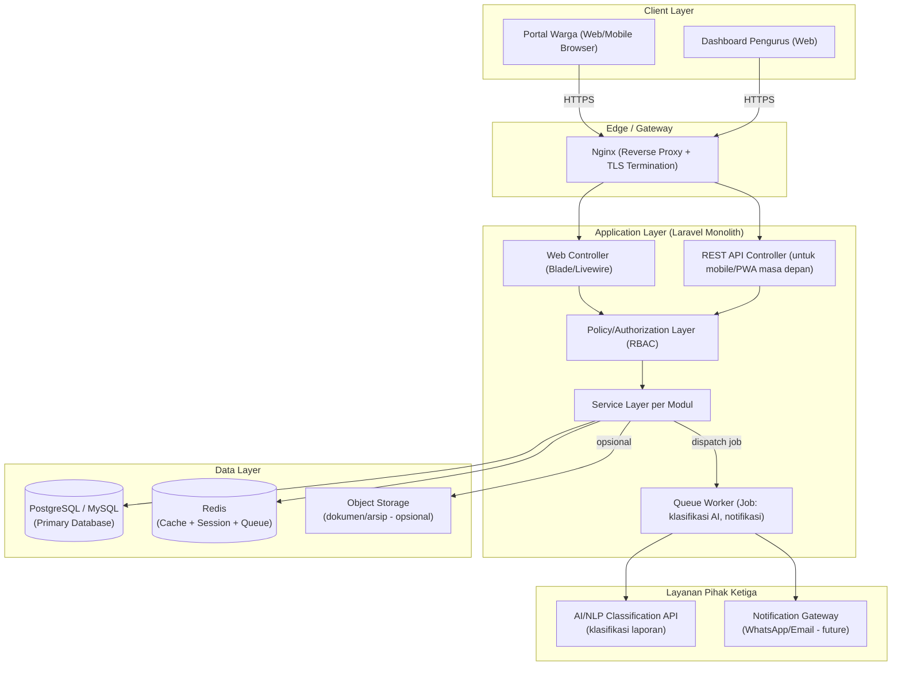
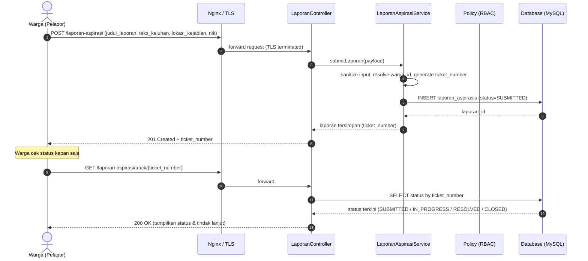
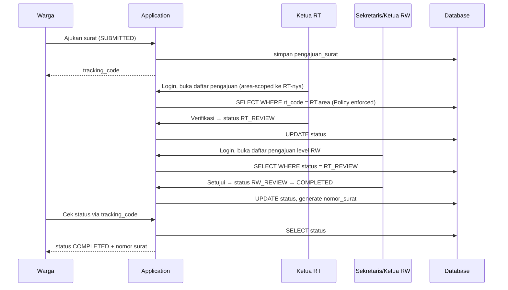
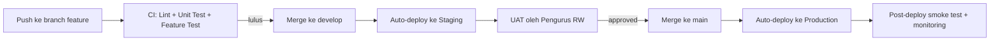

# SYSTEM ARCHITECTURE
## SIM Layanan Warga RW 047 — Rebuild Architecture Document

| | |
|---|---|
| **Dokumen turunan dari** | PRD SIM Layanan Warga RW 047 v1.0 & naskah skripsi acuan (Final_v8_revisi_full_teks.pdf) |
| **Versi dokumen** | 1.0 |
| **Status** | Draft teknis untuk tim development |
| **Audiens** | Backend Engineer, Frontend Engineer, DevOps/Infra, System Analyst |

---

## 1. Gambaran Umum Arsitektur (Architecture Overview)

### 1.1 Pola Arsitektur yang Dipilih

Sistem acuan (skripsi) dibangun sebagai **monolith klasik** (Laravel MVC, server-rendered Blade, SQLite file-based). Pola ini terbukti bekerja untuk skala single-RW, tapi punya keterbatasan concurrency, testability, dan kesiapan untuk kebutuhan lanjutan (mobile app/PWA, integrasi eksternal) yang disebutkan sebagai saran pengembangan pada skripsi.

Untuk rebuild ini, direkomendasikan pola:

> **Modular Monolith dengan Layered Architecture + API-First**

**Alasan pemilihan:**

| Pertimbangan | Microservices | Modular Monolith (dipilih) |
|---|---|---|
| Ukuran tim & kompleksitas domain | Butuh tim besar, overhead infra tinggi | Cocok untuk tim kecil–menengah, domain masih tunggal (satu RW/organisasi) |
| Kebutuhan skala saat ini | Berlebihan untuk skala RW | Cukup — traffic dan volume data relatif rendah–menengah |
| Kesiapan future mobile/PWA | Sudah API-native | Dicapai dengan API-first di dalam monolith (REST API terpisah dari Blade view) |
| Kompleksitas deployment | Tinggi (orchestration, service mesh) | Rendah–menengah (satu aplikasi, satu database) |
| Evolusi ke microservices di masa depan | — | Modul yang sudah dipisah rapi (bounded context) memudahkan ekstraksi service tertentu (mis. layanan klasifikasi AI) di masa depan |

**Prinsip modularisasi (bounded context) di dalam monolith:**

```
app/
├── Modules/
│   ├── Auth/              → Autentikasi, RBAC, session
│   ├── Kependudukan/       → Kartu Keluarga, Warga, RT
│   ├── Persuratan/        → Pengajuan surat, verifikasi berjenjang
│   ├── LaporanAspirasi/   → Pengaduan warga, klasifikasi AI
│   ├── Keuangan/          → Iuran, kas, rekapitulasi
│   ├── InformasiPublik/   → Pengumuman, agenda
│   └── Dashboard/         → Statistik & monitoring lintas modul
```

Satu modul = satu domain bisnis dengan Controller, Service, Repository, dan Model miliknya sendiri, saling berkomunikasi lewat *service layer* — bukan langsung antar-Eloquent model — agar batasan domain tetap terjaga (langkah awal jika suatu saat perlu dipecah menjadi microservice).

### 1.2 Layered Architecture (per modul)

Setiap modul mengikuti struktur berlapis yang konsisten:

```
┌─────────────────────────────────────────────┐
│  Presentation Layer                          │
│  (API Controller / Web Controller / Blade)   │
├─────────────────────────────────────────────┤
│  Application/Service Layer                   │
│  (Business logic, use case orchestration)    │
├─────────────────────────────────────────────┤
│  Domain Layer                                │
│  (Eloquent Models, Policies, Value Objects)  │
├─────────────────────────────────────────────┤
│  Infrastructure Layer                        │
│  (Repository, External API client, Queue)    │
└─────────────────────────────────────────────┘
```

Tujuan pemisahan ini: Controller **tidak boleh** berisi logika bisnis langsung (pelajaran dari sistem acuan yang menaruh cukup banyak logika di Controller) — logika dipindah ke Service agar dapat diuji unit test secara independen (mendukung NFR Maintainability pada PRD).

---

## 2. Diagram & Aliran Data (Data Flow & Diagram)

### 2.1 Arsitektur Komponen Tingkat Tinggi



### 2.2 Alur Data: Contoh Kasus "Submit & Tracking Laporan Warga"

> **Catatan Penyelarasan Scope Final:** Diagram asinkron dengan integrasi eksternal AI di bawah ini berstatus **HISTORICAL / OUT-OF-SCOPE v1** (mengacu `PROJECT_SCOPE_BOUNDARIES.md`). Pada implementasi v1 yang aktif, laporan langsung tersimpan dengan status `SUBMITTED` dan siap ditindaklanjuti langsung oleh pengurus (`SUBMITTED → IN_PROGRESS → RESOLVED → CLOSED`) tanpa dependensi layanan pihak ketiga atau queue AI.



**Poin penting desain:**
- Klasifikasi AI dijalankan **asinkron via queue**, bukan menghalangi (blocking) response ke warga — agar submit laporan tetap cepat (mendukung NFR-02 Performance) walau layanan AI eksternal lambat/timeout.
- Jika layanan AI gagal, status laporan tetap `SUBMITTED` dan job dapat di-retry (perlu dead-letter queue/fallback ke klasifikasi manual oleh pengurus).

### 2.3 Alur Data: Contoh Kasus "Verifikasi Surat Berjenjang"



**Penegakan keamanan pada alur ini:** setiap query daftar pengajuan **wajib difilter di backend** berdasarkan `rt_code`/wilayah milik user yang login (Policy/area scoping) — bukan hanya disaring di frontend — untuk mencegah IDOR sebagaimana ditekankan pada sistem acuan.

---

## 3. Komponen Utama (Core Components)

### 3.1 Backend

| Aspek | Spesifikasi |
|---|---|
| **Framework** | Laravel 10 (versi LTS) |
| **Bahasa** | PHP 8.1+ (Baseline Composer `^8.1`) |
| **Pola** | Modular Monolith, Layered Architecture (Controller → Service → Repository → Model) |
| **Peran utama** | Menjalankan seluruh business logic: validasi, RBAC enforcement, orkestrasi transaksi antar-modul, penjadwalan job asinkron |
| **API** | REST API (Laravel API Resource) sebagai kontrak utama, dikonsumsi baik oleh Blade/Livewire frontend maupun (di masa depan) aplikasi mobile/PWA |
| **Job Queue** | Laravel Queue (driver Redis) untuk tugas asinkron: klasifikasi AI, notifikasi, generate laporan besar |
| **Scheduler** | Laravel Scheduler (cron) untuk tugas berkala: rekapitulasi laporan bulanan, pembersihan data soft-deleted lama |
| **Validasi** | Form Request classes per endpoint — validasi terpusat, tidak tercampur di Controller |

### 3.2 Frontend

| Aspek | Spesifikasi |
|---|---|
| **Pendekatan** | Server-rendered (Blade + Livewire/Alpine.js) untuk dashboard internal pengurus — cepat dikembangkan, cocok untuk pengguna dengan literasi digital terbatas |
| **Portal Warga (publik)** | Dapat tetap Blade responsif, atau opsional dipisah sebagai SPA ringan (Vue/React) jika roadmap mobile app/PWA diprioritaskan lebih awal |
| **Styling** | Tailwind CSS — mobile-first (selaras dengan NFR-05 Compatibility pada PRD) |
| **State management (jika SPA)** | Pinia (Vue) / Redux-lite (React) — hanya diperlukan bila memilih jalur SPA |
| **Komunikasi ke Backend** | Untuk Blade/Livewire: request langsung ke controller (server-driven). Untuk SPA/mobile: REST API dengan token-based auth (lihat Bagian 4) |

### 3.3 Database

| Aspek | Spesifikasi |
|---|---|
| **Engine utama** | PostgreSQL (direkomendasikan) atau MySQL 8+ — menggantikan SQLite file-based pada sistem acuan agar mendukung concurrency multi-user produksi |
| **Cache & Session Store** | Redis — menyimpan session, cache query yang sering diakses (mis. dashboard statistik), serta backend untuk Queue |
| **Object Storage (opsional)** | S3-compatible storage (mis. AWS S3/MinIO) — untuk lampiran laporan (foto kejadian) atau arsip dokumen di fase lanjutan |
| **Skema data** | Mengikuti domain pada ERD/LRS: Auth & RBAC, Kependudukan, Persuratan, Laporan & Aspirasi, Keuangan, Informasi Publik, Audit Log (lihat PRD Bagian 6.3) |
| **Migrasi** | Laravel Migration — version-controlled, direview sebagai bagian dari code review |
| **Backup** | Automated daily backup + point-in-time recovery (PITR) jika menggunakan managed database service |

### 3.4 Layanan Pihak Ketiga (Third-Party Services)

| Layanan | Fungsi | Sifat Integrasi |
|---|---|---|
| **AI/NLP Classification Service** | Klasifikasi otomatis kategori & prioritas laporan/aspirasi warga (fitur inti yang disebut eksplisit dalam skripsi) | Dipanggil asinkron via Queue Job; bisa berupa API eksternal (LLM provider) atau model NLP ringan yang di-hosting terpisah dari core app |
| **Notification Gateway** (rekomendasi pengembangan, belum in-scope versi awal) | Notifikasi WhatsApp/Email/SMS saat status surat/laporan berubah | Out-of-scope versi awal — disiapkan sebagai extension point di Service Layer |
| **Object Storage Provider** (opsional) | Penyimpanan lampiran dokumen/foto | Digunakan bila fitur lampiran diaktifkan |
| **Monitoring/Error Tracking** | Sentry atau setara — memantau error produksi | Terintegrasi di seluruh layer aplikasi |

---

## 4. Strategi Keamanan & Autentikasi (Security & Authentication)

### 4.1 Autentikasi

| Kanal | Mekanisme |
|---|---|
| **Web (Blade/Livewire, session-based)** | Laravel Session Authentication (cookie httpOnly + secure), cocok untuk dashboard internal pengurus yang selalu diakses via browser yang sama |
| **API (untuk kebutuhan mobile/PWA masa depan)** | Laravel Sanctum — token berbasis SPA/mobile authentication, lebih ringan dari OAuth2 penuh dan cukup untuk kebutuhan first-party client |
| **Password** | Hash satu arah (bcrypt/argon2), tidak pernah disimpan atau di-log dalam bentuk plain text |

> **Catatan:** JWT/OAuth2 penuh (mis. Passport) baru relevan jika di masa depan ada integrasi pihak ketiga eksternal (aplikasi non-first-party) yang perlu mengakses API. Untuk versi awal rebuild, Sanctum dengan session/token first-party sudah cukup dan lebih sederhana untuk dipelihara.

### 4.2 Mekanisme Perlindungan Login

Dipertahankan dan diperkuat dari sistem acuan:

- **Rate limiting**: maksimal percobaan login terbatas per kombinasi IP + email (mis. 5x/menit) menggunakan Laravel Rate Limiter, guna mencegah brute-force.
- **Session regeneration**: session ID diregenerasi saat login berhasil.
- **Session invalidation**: session diinvalidasi total saat logout (mencegah session fixation).
- **Password policy**: minimal panjang & kompleksitas password dikonfigurasi di Form Request registrasi/reset password.
- **Two-Factor Authentication (rekomendasi peningkatan)**: dapat ditambahkan untuk peran dengan hak akses tinggi (Super Admin, Ketua RW) sebagai lapisan tambahan.

### 4.3 Otorisasi (Role-Based Access Control)

| Lapisan | Implementasi |
|---|---|
| **Definisi role & permission** | Package `spatie/laravel-permission` direkomendasikan untuk mengelola role & permission secara terstruktur (menggantikan pengelolaan role manual pada sistem acuan) |
| **Penegakan di Controller/Service** | Laravel Policy (`$this->authorize()`) — **wajib** dipanggil di setiap action yang mengubah/membaca data sensitif, bukan hanya disembunyikan di menu UI |
| **Area scoping (multi-RT)** | Setiap query yang mengambil data warga/surat/laporan **wajib** difilter berdasarkan `rt_code`/wilayah kewenangan user yang login, diterapkan di level Service/Repository (global scope Eloquent direkomendasikan agar tidak lupa diterapkan di setiap query) |
| **Anti-IDOR** | Request ke resource ID yang bukan miliknya/wewenangnya wajib ditolak dengan HTTP 403 Forbidden — ini adalah requirement keras dari sistem acuan yang wajib dipertahankan |

### 4.4 Perlindungan Data Sensitif

| Data | Perlindungan |
|---|---|
| **NIK, No. KK** | Enkripsi **AES-256-CBC** di application layer (Laravel Crypt) sebelum disimpan — database tidak pernah menyimpan plaintext |
| **Pencarian data terenkripsi** | Hash deterministik **HMAC-SHA256** disimpan sebagai kolom terpisah (mis. `nik_hash`) untuk exact-match lookup tanpa membuka nilai asli |
| **Key management** | Encryption key **tidak** disimpan hardcoded di `.env` produksi — direkomendasikan menggunakan secret manager (AWS Secrets Manager/HashiCorp Vault/setara) dengan rotasi key berkala |
| **Data di UI** | Nomor NIK/KK ditampilkan masked (mis. `3216xxxxxxxx0012` — first 4 + 8 'x' + last 4) secara default; hanya role tertentu (Super Admin/Sekretaris RW) yang dapat melihat data unmasked, dan setiap akses unmasked dicatat di audit log |
| **Input sanitization** | Semua input teks bebas (deskripsi laporan, keperluan surat) disanitasi untuk mencegah XSS/SQL Injection (Laravel Eloquent ORM + escaping Blade sudah menangani sebagian besar, tetap perlu validasi eksplisit) |

### 4.5 Audit Trail

- Setiap perubahan pada entitas transaksional (kependudukan, surat, laporan, keuangan) dicatat: **siapa** (user_id), **kapan** (timestamp), **apa** yang berubah (before/after atau minimal action type).
- Soft-delete (`deleted_at`) dipertahankan pada seluruh tabel transaksional — tidak ada hard delete pada data operasional.
- Log akses terhadap data sensitif (unmasked NIK/KK) dicatat terpisah untuk keperluan compliance.

### 4.6 Keamanan Transport & Infrastruktur

- **HTTPS wajib** di seluruh environment (termasuk staging) — TLS termination di Nginx.
- **CORS** dikonfigurasi ketat, hanya mengizinkan origin resmi aplikasi.
- **CSRF protection** aktif untuk seluruh form berbasis session (default Laravel).
- **Security headers** (Content-Security-Policy, X-Frame-Options, HSTS) dikonfigurasi di Nginx.
- **Dependency scanning** berkala (mis. `composer audit`, Dependabot) untuk mendeteksi kerentanan pada package pihak ketiga.

---

## 5. Rekomendasi Lingkungan & Penyebaran (Deployment & Infrastructure)

### 5.1 Strategi Environment

| Environment | Tujuan | Karakteristik |
|---|---|---|
| **Local** | Development harian oleh developer | Docker Compose (App + PostgreSQL + Redis) menggantikan Laragon pada sistem acuan agar konsisten lintas OS (Windows/Mac/Linux) |
| **Staging** | Testing terintegrasi, UAT bersama pengurus RW sebelum rilis | Konfigurasi mendekati produksi, data dummy/anonim, dapat direset kapan saja |
| **Production** | Layanan aktif digunakan warga & pengurus | Data riil, akses terbatas, monitoring aktif, backup rutin |

### 5.2 Perbandingan Infra: Sistem Acuan vs Rekomendasi Rebuild

| Aspek | Sistem Acuan (Skripsi) | Rekomendasi Rebuild |
|---|---|---|
| Dev environment | Laragon (lokal, Windows-only) | Docker Compose (cross-platform, reproducible) |
| Database | SQLite (file, single-writer) | PostgreSQL/MySQL (managed service, mendukung concurrency) |
| Web server | Nginx lokal | Nginx sebagai reverse proxy di depan PHP-FPM, dikelola via container/VM |
| Hosting | Tidak ada (riset, lokal saja) | Cloud VPS/PaaS (lihat opsi di bawah) |
| CI/CD | Tidak ada | GitHub Actions/GitLab CI — otomatisasi test & deploy |
| Monitoring | Tidak ada | Sentry (error tracking) + uptime monitoring |

### 5.3 Opsi Hosting/Cloud

| Opsi | Kelebihan | Kapan Dipilih |
|---|---|---|
| **VPS terkelola sendiri** (DigitalOcean, Contabo) + Nginx + PHP-FPM manual/Docker | Biaya rendah, kontrol penuh | Anggaran terbatas, tim punya kapasitas ops |
| **PaaS Laravel-friendly** (Laravel Forge + DO/AWS, atau Laravel Cloud) | Deployment & provisioning otomatis, cocok tim kecil | Ingin fokus ke fitur, minim overhead DevOps |
| **Managed Database** (AWS RDS, DigitalOcean Managed PostgreSQL) | Backup otomatis, high availability, tanpa perlu mengelola database sendiri | Direkomendasikan untuk komponen database di semua opsi di atas |
| **Container orchestration** (Docker Swarm/Kubernetes) | Skalabilitas tinggi | Baru relevan bila skala berkembang ke multi-RW/multi-tenant yang signifikan — **berlebihan untuk versi awal** |

**Rekomendasi konkret untuk versi awal rebuild:** VPS/PaaS sederhana (mis. Laravel Forge + DigitalOcean Droplet) + Managed PostgreSQL + Redis terpisah — cukup untuk beban single-RW, mudah di-upgrade kapasitasnya (vertical scaling) sebelum perlu horizontal scaling/kontainerisasi penuh.

### 5.4 Pipeline CI/CD (disarankan)



**Praktik pendukung:**
- Setiap deploy ke produksi melalui **migration otomatis dengan strategi rollback** yang jelas.
- **Feature flag** untuk fitur berisiko (mis. modul klasifikasi AI) agar dapat dinonaktifkan cepat tanpa rollback penuh bila layanan AI eksternal bermasalah.
- **Zero-downtime deployment** (mis. via Laravel Envoyer/queue restart terjadwal) agar layanan warga tidak terganggu saat rilis.

### 5.5 Strategi Backup & Disaster Recovery

| Komponen | Strategi |
|---|---|
| Database | Automated daily backup + retention 30 hari; snapshot sebelum setiap migrasi besar |
| File/Object Storage | Versioning aktif bila menggunakan S3-compatible storage |
| Encryption keys | Disimpan terpisah dari backup database (agar backup yang bocor tidak otomatis membuka data terenkripsi) |
| Recovery Time Objective (RTO) | Target dapat pulih dalam hitungan jam untuk skala operasional RW (nilai pasti disepakati bersama stakeholder saat implementasi) |

---

## 6. Ringkasan Prinsip Arsitektur

1. **Modular Monolith** — cukup untuk skala saat ini, tetap terstruktur rapi untuk evolusi ke microservices bila diperlukan di masa depan.
2. **API-first di dalam monolith** — menyiapkan fondasi untuk mobile app/PWA tanpa perlu rebuild besar-besaran nanti.
3. **Keamanan berlapis** — enkripsi at-rest, RBAC ditegakkan di backend, area scoping ketat, audit trail menyeluruh — seluruhnya adalah penguatan dari praktik baik yang sudah terbukti di sistem acuan.
4. **Pemrosesan asinkron** untuk tugas yang berpotensi lambat (klasifikasi AI, notifikasi) agar tidak mengorbankan pengalaman pengguna.
5. **Infrastruktur bertahap** — mulai dari VPS/PaaS sederhana, upgrade ke arsitektur yang lebih kompleks hanya ketika skala benar-benar membutuhkannya.
